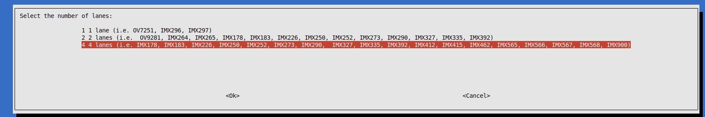
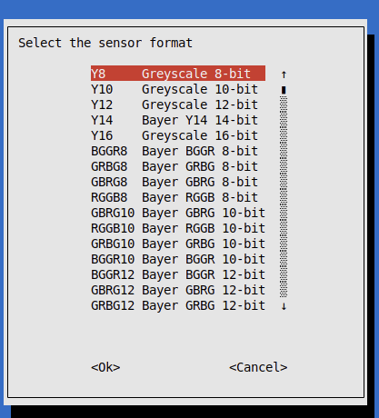
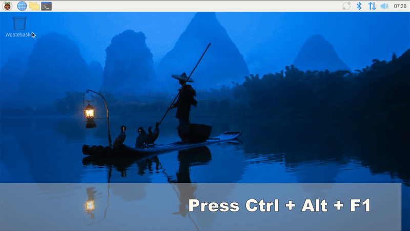

# Raspberry Pi 5 Driver for VC MIPI
This driver package is supporting the offical Raspberry Pi 5. 
Downloads are available under 

[Releases](https://github.com/VC-MIPI-modules/vc_mipi_raspi/releases)

For raspberrypi 3 and 4 modules and compute modules, please use this driver installation

[Raspi3 and 4 Driver](https://www.mipi-modules.com/fileadmin/external/documentation/hardware/VC_MIPI_Raspberry_PI/index.html)

# Installation
The driver is tested on booksworm with 64 bit
Run installation with the installation of the needed packages 
```
sudo apt install ./vc-mipi-driver-bcm2712_0.3.1_arm64.deb
```
<b>or</b>
Run the installation with manual packages
```
sudo apt install dkms, linux-headers-generic, v4l-utils, whiptail 
sudo dpkg -i ./vc-mipi-driver-bcm2712_0.3.1_arm64.deb
```
After a reboot the connected sensor(s) should be detected and visible as v4l2 capture devices
Under the current raspberry pi OS with booksworm, 
the sensors are:

| Camera   | Device      | Subdevice        |
| -------- | ----------- | ---------------- |
| Cam0     | /dev/video0 | /dev/v4l-subdev2 |
| Cam1     | /dev/video8 | /dev/v4l-subdev5 |


# Building debian package

Running dpkg-buildpackage by script creates debian package

## Requirements
```
sudo apt-get install debhelper-compat  dkms dh-dkms debhelper  linux-headers-generic
```
## Script
```
bash createDebianPackage.sh
```

# Configuration on Raspberry Pi 5

1. The configuration for the VC Mipi Sensors is in the boot file 
<i>/boot/firmware/config_vc-mipi-driver-bcm2712.txt</i>. 
The right lanes configuration for the sensors has to be made. For some sensors, 2 modes are available. 
If no specific configuration is needed, the "more lanes" configuration is the first choice (i.e. 4 instead 2 lanes)
2. Additionaly the configuration tool vc-config is installed. By calling ```vc-config```
Here, there are also the possibilities to change the values of the controls and also the Region of Interests (ROI)
3. The formats can be adjusted. All formats are displayed, although not all are available which depends on the sensor model






# Support Tool
## Installation
The official support tool for the v4l2 driver is 
[V4L2-Test](https://github.com/pmliquify/v4l2-test/tree/master)

Please refer to the installation there. 
## Usage
For starting, you have to add the subdevice properly in order to set the controls by tool
```bash
./v4l2-test stream -e <exposure> -g <gain> -f <pixelformat> -p 1 -d <device> -sd <subdevice>
# Camera 0
./v4l2-test stream -e <exposure> -g <gain> -f <pixelformat> -p 1 -d /dev/video0 -sd /dev/v4l-subdev2
# Camera 1
./v4l2-test stream -e <exposure> -g <gain> -f <pixelformat> -p 1 -d /dev/video8 -sd /dev/v4l-subdev5
```
## Display live image

For getting the live image on screen, add the argument `--fb`

```bash
./v4l2-test stream -e <exposure> -g <gain> -f <pixelformat>  -d <device> -sd <subdevice> --fb
# Camera 0
./v4l2-test stream -e <exposure> -g <gain> -f <pixelformat>  -d /dev/video0 -sd /dev/v4l-subdev2 --fb
# Camera 1
./v4l2-test stream -e <exposure> -g <gain> -f <pixelformat>  -d /dev/video8 -sd /dev/v4l-subdev5 --fb
```

On desktop version, first you have to switch to console mode `Ctrl + Alt + F1`



# Controls
1. [Black level](./docs/black_level.md)
2. [IO Mode](./docs/io_mode.md)
3. [Trigger mode](./docs/trigger_mode.md)
4. [Binning mode](./docs/binning_mode.md)

# Known issues

The driver offers the basic features of the VC MIPI sensors. 
This has the advantage that the same functions are available with all sensors. 
If special functions are required, please contact the support team or your contact at Vision Components GmbH 

1. The flipping controls are not supported by standard driver

<b>[FAQ](./docs/faq.md)