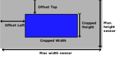

# ROI Position
In case of a cropped image, 
the ROI can be shifted. 
The cropping has to be done first
The value is a combined value with the following formatting.

The first  5 digits are the offset to the top.
The second 5 digts are the offset from the left
The 11th digit is the binning (Not supported on all sensors)
B_LLLLL_TTTTT

Example:

00011100333 => 111 bits shifted from left, 333 bits shifted from top

```shell
v4l2-ctl -c -d <SUBDEV> roi_position=value
```
